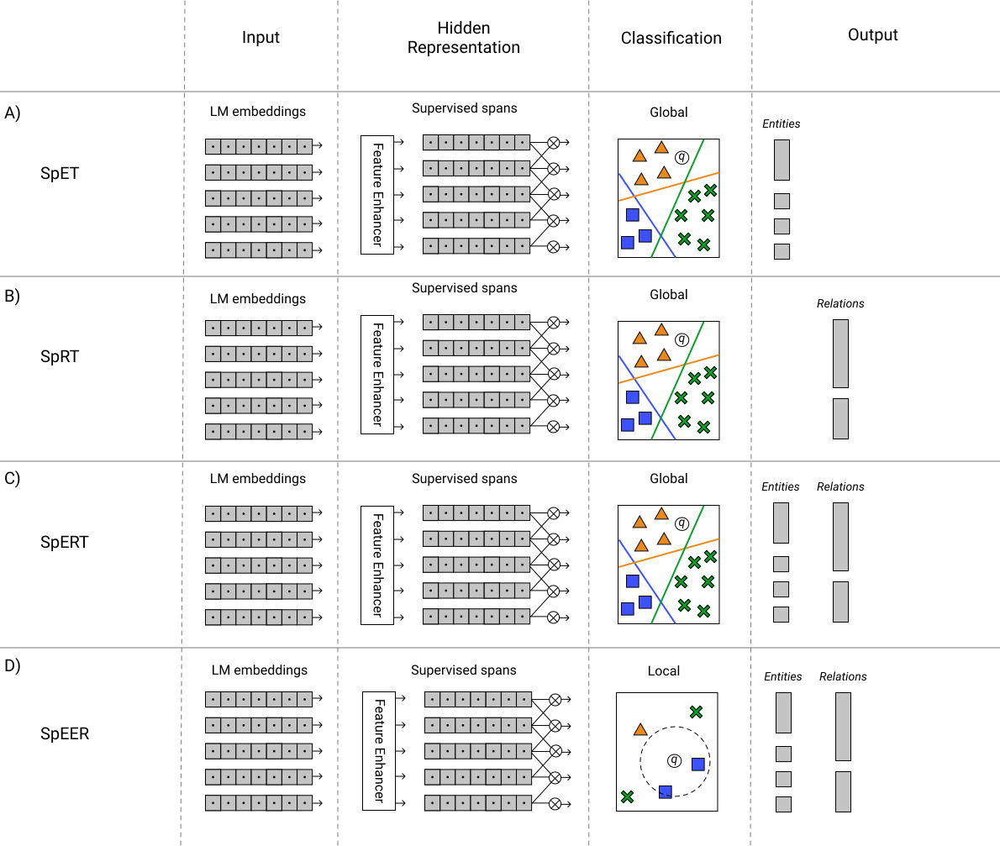

## Models:
### SpERT (original): Span-based Entity and Relation Transformer
### SpEER: Span-based Encoder for Entities and Relations
### SpET: Span-based Entity Transformer
### SpRT: Span-based Relation Transformer

This PyTorch code is part of a MSc Thesis AI for the University of Amsterdam: "Iterative Knowledge Graph Population using Entity and Relation Extraction"

The Span-based extractors are built on SpERT framework https://github.com/markus-eberts/spert

Check out their paper: "Span-based Entity and Relation Transformer" https://arxiv.org/abs/1909.07755 (accepted at ECAI 2020).

### Overview of model architectures used


## Setup
### Requirements
- Required
  - Python 3.5+
  - PyTorch 1.1.0+ (tested with version 1.3.1)
  - transformers 2.2.0+ (tested with version 2.2.0)
  - scikit-learn (tested with version 0.21.3)
  - tqdm (tested with version 4.19.5)
  - numpy (tested with version 1.17.4)
- Optional
  - jinja2 (tested with version 2.10.3) - if installed, used to export relation extraction examples
  - tensorboardX (tested with version 1.6) - if installed, used to save training process to tensorboard
  
- A conda virtual env setup is included in _environment.yml_, activate using:
  ```conda env create -f environment.yml```
  
- For SpEER a k-nn classifier is needed, currently only NearestNeighBERT is supported. To install do:
  - Download/clone Nearest NeighBERT: https://github.com/Poezedoez/NearestNeighBERT
  - Install with pip:
     ```
    pip install .
    ```

### Data
The models can be tested on existing datasets. You can download the original CoNLL03 and SemEval2017 Task10 datasets.
Reformat data using _reformat.py_

## Examples
Train:
```python main.py train --config configs/speer/conll03_train.conf ```

The trained model is now saved in _data/speer/save/conll03_train/_.

Evaluate:
```python main.py eval --config configs/speer/conll03_eval.conf ```

